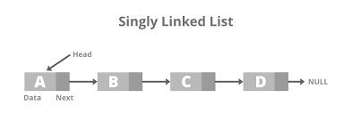
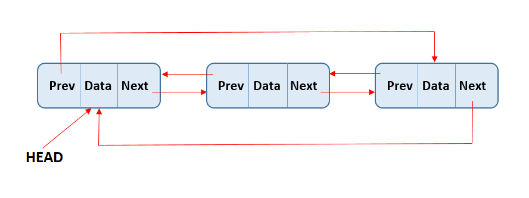

# 💫 About Me:
🔭 I’m currently studying at Padang State University  🌱 I’m currently learning C Language  👩🏼‍💻My major is informatics engineering  🌷 Fun fact I love watching drakor and sleeping  "just because it's hard doesn't mean it's impossible. you can do it"

## 🌐 Socials:
   

# 💻 Tech Stack:
    
# 📊 GitHub Stats:
 

## 🏆 GitHub Trophies

### ✍️ Random Dev Quote

### 🔝 Top Contributed Repo

---

<!-- Proudly created with GPRM ( https://gprm.itsvg.in ) -->

# Job Sheet 1

Job Sheet 1 menjelaskan bahwa struktur data merupakan cara penyimpanan, penyusunan, dan pengaturan data di dalam media penyimpanan komputer. Merupakan representasi fakta dunia nyata yang disimpan, direkam, atau direpresentasikan dalam bentuk tulisan, suara, gambar, sinyal atau simbol. Dalam pemrograman, struktur data berarti tata letak data yang berisi kolom-kolom data, baik itu kolom yang tampak oleh pengguna (user) atau pun kolom yang hanya digunakan untuk keperluan pemrograman yang tidak tampak oleh pengguna. Struktur data dapat dikategorikan menjadi tipe data sederhana tunggal, seperti Integer, real, boolean dan karakter, serta tipe data sederhana majemuk, seperti String (kumpulan data char). Struktur data yang standar yang biasanya digunakan dibidang informatika adalah List linier (Linked List), Multilist, Stack (Tumpukan), Queue (Antrian), Tree (Pohon), dan Graph (Graf)

# Job Sheet 2

Job Sheet 2 menjelaskan bahwa array adalah suatu kumpulan nilai yang bertipe data sama, dengan masing-masing elemen array diakses menggunakan indeks. Deklarasi array dilakukan dengan menuliskan tipe data, nama array, dan ukuran array. Pointer adalah variable yang berisi alamat memory sebagai nilainya, berbeda dengan variable biasa yang berisi nilai tertentu. Deklarasi pointer dilakukan dengan menambahkan tanda asterisk (*) pada tipe data yang akan dijadikan pointer. Structure adalah kumpulan variable yang bernama objek yang serumpun, dengan tipe-tipe yang berbeda. Deklarasi structure dilakukan dengan menuliskan tipe data dan nama variable, serta mengisi nilai dari setiap variable.

Karakteristik Array:
Homogenitas: Semua elemen dalam array harus memiliki tipe data yang sama.
Akses Indeks: Elemen array diakses menggunakan indeks.
Ukuran Tetap: Ukuran array ditentukan pada saat deklarasi dan tidak dapat diubah.

Karakteristik Pointer:
Referensi Memori: Menyimpan alamat memori dari variabel lain.
Operasi Aritmetika: Pointers dapat digunakan dalam operasi aritmetika untuk navigasi melalui memori.
Dereferensi: Mengakses nilai yang disimpan di alamat memori yang ditunjuk oleh pointer.

Karakteristik Structure:
Heterogenitas: Anggota struct bisa memiliki tipe data yang berbeda.
Pengelompokan Data: Mengelompokkan data yang terkait dalam satu entitas.
Akses Anggota: Anggota struct diakses menggunakan operator titik (.).

# Job Sheet 3

Job Sheet 3 menjelaskan bahwa single linked list merupakan sebuah data yang berupa simpul atau node beralamat yang saling bertaut. Setiap simpul bisa menyimpan data yang mana isinya bisa char, int, string atau tipe data lainnya. Sebuah linked list sederhana terdiri dari sebuah simpul special yang hanya memiliki alamat/pointer simpul ini dinamakan HEAD, dan sebuah simpul TAIL yang tidak menuju kemanapun. Penggunaan alokasi memori memungkinkan user untuk membuat tipe data dan struktur dengan ukuran dan panjang berapapun yang disesuaikan dengan kebutuhan di dalam program. Perintah sizeof digunakan untuk mendapatkan ukuran dari berbagai tipe data, variabel, ataupun struktur. Perintah malloc() digunakan untuk mengalokasikan memori.
Berikut adalah beberapa poin utama mengenai Single Linked List:

Node: Setiap elemen dalam linked list disebut node. Setiap node berisi dua komponen utama:

Data: Menyimpan nilai atau informasi yang diinginkan.
Pointer (atau Next): Menyimpan alamat atau referensi ke node berikutnya dalam daftar.
Head: Merupakan node pertama dalam linked list. Jika linked list kosong, maka head akan mengarah ke null (atau none dalam Python).

Tail: Dalam implementasi single linked list, node terakhir akan memiliki pointer yang mengarah ke null (atau none dalam Python), menandakan akhir dari linked list.

Traversal: Untuk mengakses elemen tertentu dalam linked list, kita perlu memulai dari head dan mengikuti pointer hingga mencapai node yang diinginkan. Proses ini disebut traversal.

Operasi Dasar: Beberapa operasi dasar yang dapat dilakukan pada single linked list meliputi:

Insertion: Menambahkan node baru ke dalam linked list. Node baru bisa ditambahkan di awal (setelah head), di akhir (sebelum node yang mengarah ke null), atau di tengah (pada posisi tertentu).
Deletion: Menghapus node dari linked list. Node yang dihapus bisa berada di awal, di akhir, atau di tengah.
Search: Mencari node yang menyimpan nilai tertentu.
Update: Mengubah nilai yang disimpan dalam node tertentu.

Keunggulan dan Kelemahan:
Keunggulan: Struktur data dinamis yang dapat dengan mudah menyesuaikan ukuran. Penambahan dan penghapusan elemen dapat dilakukan lebih efisien dibandingkan dengan array jika dilakukan di awal atau tengah linked list.
Kelemahan: Tidak memiliki akses langsung ke elemen tertentu (tidak seperti array), sehingga operasi pencarian elemen tertentu bisa lebih lambat. Membutuhkan lebih banyak memori karena perlu menyimpan pointer selain data.

# Job Sheet 4

Job Sheet 4 menjelaskan bahwa doubly linked list merupakan sebuah data yang berupa simpul atau node beralamat yang saling bertaut. Setiap simpul bisa menyimpan data yang mana isinya bisa char, int, string atau tipe data lainnya. Sebuah linked list sederhana terdiri dari sebuah simpul special yang hanya memiliki alamat/pointer simpul ini dinamakan HEAD, dan sebuah simpul TAIL yang tidak menuju kemanapun.Penggunaan alokasi memori memungkinkan user untuk membuat tipe data dan struktur dengan ukuran dan panjang berapapun yang disesuaikan dengan kebutuhan di dalam program. Perintah sizeof digunakan untuk mendapatkan ukuran dari berbagai tipe data, variabel, ataupun struktur. Perintah malloc() digunakan untuk mengalokasikan memori.

Keunggulan dan Kelemahan:
Keunggulan: Memungkinkan traversal dua arah, lebih fleksibel dalam operasi penambahan dan penghapusan node karena memiliki referensi ke node sebelumnya dan berikutnya.
Kelemahan: Memerlukan lebih banyak memori dibandingkan dengan single linked list karena menyimpan dua referensi (next dan prev) di setiap node.

# Job Sheet 5

Job Sheet 5 menjelaskan tentang teori dasar Double Linked List dan Circular Linked List. Double Linked List adalah jenis linked list yang menggunakan dua pointer dalam satu node, yang menyebabkan list melintas baik ke depan (next) maupun ke belakang (prev) atau (back). Circular Linked List adalah bentuk lain dari linked list yang memberikan fleksibilitas dalam melewatkan elemen. Circular List bisa berupa single linked list atau double linked list, tetapi tidak mempunyai tail. Pada circular list, pointer next dari elemen terakhir menunjuk ke elemen pertama dan bukan menunjuk NULL. Pada double linked circular list, pointer prev dari elemen pertama menunjuk ke elemen terakhir.

Doubly Linked List adalah struktur data yang terdiri dari rangkaian node, di mana setiap node memiliki tiga komponen utama:
Data: Menyimpan nilai atau informasi yang diinginkan.
Next: Menyimpan referensi (atau pointer) ke node berikutnya dalam daftar.
Prev: Menyimpan referensi ke node sebelumnya dalam daftar.

Keunggulan dan Kelemahan:
Keunggulan: Memungkinkan traversal dua arah (maju dan mundur), Memudahkan operasi penghapusan dan penyisipan elemen di tengah daftar.
Kelemahan: Menggunakan lebih banyak memori dibandingkan single linked list karena setiap node menyimpan dua referensi.

# Job Sheet 6

Job Sheet 6 menjelaskan bahwa stack adalah sebuah kumpulan data dimana data yang diletakkan di atas data yang lain. Elemen terakhir yang disimpan dalam stack menjadi elemen pertama yang diambil. Dalam praktikum ini, mahasiswa akan mempelajari penggunaan stack dalam proses komputasi, seperti menambah dan mengurangi elemen stack, mengubah elemen stack, dan memeriksa apakah stack kosong atau penuh. Selain itu Job Sheet 5 juga menjelaskan tentang implementasi stack menggunakan array dan linked list. Dalam implementasi stack menggunakan array, mahasiswa akan membuat sebuah array dengan ukuran tertentu, menambah elemen ke dalam array, dan mengurangi elemen dari array. Dalam implementasi stack menggunakan linked list, mahasiswa akan membuat sebuah node dengan data dan pointer ke node berikutnya, menambah node ke dalam linked list, dan mengurangi node dari linked list. Job sheet 5 juga menjelaskan tentang penggunaan fungsi push, pop, peek, isFull, isEmpty, clear, dan driver program untuk mengetes fungsi-fungsi tersebut. Dalam praktikum ini, mahasiswa akan mempelajari cara menggunakan fungsi push untuk menambah elemen ke stack, fungsi pop untuk mengurangi elemen dari stack, fungsi peek untuk mengecek elemen paling atas stack tanpa menghapusnya, fungsi isFull untuk mengecek apakah stack penuh, fungsi isEmpty untuk mengecek apakah stack kosong, dan fungsi clear untuk mengosongkan stack.

Karakteristik Utama Stack:
Push: Operasi untuk menambahkan elemen ke dalam stack.
Pop: Operasi untuk mengeluarkan elemen dari stack. Elemen yang dikeluarkan adalah elemen yang terakhir kali dimasukkan.
Top/Peek: Operasi untuk melihat elemen yang berada di posisi paling atas dari stack tanpa mengeluarkannya.
IsEmpty: Operasi untuk memeriksa apakah stack kosong atau tidak.

# Job Sheet 7

Job Sheet 7 menjelaskan tentang antrian (queue) dalam praktikum Struktur Data Teknik Informatika. Antrian adalah sebuah data structure yang berguna pada pemrograman. Antrian menggunakan prinsip FIFO (First-In-First-Out), dimana item yang mendapat giliran pertama adalah item yang pertama keluar. Antrian dapat menggunakan array atau linked list untuk implementasi. Antrian dapat digunakan untuk memecahkan permasalahan pemrograman, misalnya untuk menambah dan menghapus elemen dari antrian. Job Sheet 7 juga menjelaskan tentang queue dengan array dan queue dengan linked list. Pada queue dengan array, digunakan sejumlah array MAX untuk menyimpan data. Untuk queue dengan linked list, digunakan struct node untuk menyimpan data.

FIFO (First In, First Out): Elemen pertama yang masuk akan menjadi elemen pertama yang keluar.
Operasi Dasar:
Enqueue: Menambahkan elemen ke akhir antrian.
Dequeue: Menghapus elemen dari awal antrian.
Peek/Front: Melihat elemen di awal antrian tanpa menghapusnya.
IsEmpty: Memeriksa apakah antrian kosong.
Size: Mendapatkan jumlah elemen dalam antrian

# Job Sheet 8

Job Sheet 8 ini menjelaskan tentang Bubble Sort adalah algoritma pengurutan sederhana yang bekerja dengan membandingkan elemen-elemen bersebelahan dalam daftar dan menukarnya jika mereka dalam urutan yang salah. Proses ini berulang hingga seluruh daftar terurut.Cara Kerja Mulai dari elemen pertama, bandingkan elemen saat ini dengan elemen berikutnya, Jika elemen saat ini lebih besar dari elemen berikutnya, tukar kedua elemen tersebut,Lanjutkan ke pasangan elemen berikutnya dan ulangi langkah 2. Setelah satu iterasi lengkap, elemen terbesar akan "menggelembung" ke posisi akhirnya. Ulangi proses ini untuk sisa elemen hingga tidak ada lagi elemen yang perlu ditukar.
Insertion Sort adalah algoritma pengurutan yang membangun daftar terurut satu elemen pada satu waktu. Ini bekerja dengan mengiterasi daftar input dan pada setiap iterasi, menempatkan elemen saat ini ke dalam posisi yang benar di sub-daftar terurut. Cara Kerja Mulai dengan elemen kedua, anggap elemen pertama sudah terurut.
Bandingkan elemen saat ini dengan elemen sebelumnya dalam sub-daftar terurut. Geser elemen-elemen yang lebih besar dari elemen saat ini satu posisi ke kanan.
Tempatkan elemen saat ini di posisi yang benar. Ulangi proses ini untuk setiap elemen dalam daftar.

Bubble Sort
Cara Kerja
Bubble Sort bekerja dengan cara berulang kali membandingkan pasangan elemen yang berdekatan dan menukar elemen tersebut jika mereka berada dalam urutan yang salah. Proses ini diulang terus hingga tidak ada lagi elemen yang perlu ditukar, yang berarti daftar sudah terurut.

Langkah-langkah
Mulai dari elemen pertama dari array.
Bandingkan elemen saat ini dengan elemen berikutnya.
Jika elemen saat ini lebih besar dari elemen berikutnya, tukar kedua elemen tersebut.
Pindah ke pasangan elemen berikutnya.
Ulangi proses dari langkah 1 hingga langkah 4 untuk semua elemen, kecuali elemen terakhir.
Ulangi seluruh proses untuk n-1 elemen teratas (dimana n adalah panjang array), dan terus ulangi dengan mengurangi elemen yang diperiksa hingga tidak ada lagi elemen yang perlu ditukar.

Kelebihan dan Kekurangan
Kelebihan: Mudah dipahami dan diimplementasikan.
Kekurangan: Tidak efisien untuk daftar yang besar karena kompleksitas waktu O(n²).

Insertion Sort
Cara Kerja
Insertion Sort bekerja dengan cara membangun daftar yang diurutkan satu per satu dengan mengambil satu elemen dari daftar input dan menempatkannya pada posisi yang tepat di daftar yang diurutkan.

Langkah-langkah
Mulai dari elemen kedua dari array (anggap elemen pertama sudah terurut).
Ambil elemen saat ini sebagai "kunci" (key).
Bandingkan "kunci" dengan elemen-elemen sebelumnya dan geser elemen-elemen yang lebih besar ke kanan.
Tempatkan "kunci" pada posisi yang tepat di antara elemen-elemen yang lebih kecil dan lebih besar.
Ulangi proses dari langkah 2 hingga semua elemen telah diproses.

Kelebihan dan Kekurangan
Kelebihan: Efisien untuk daftar kecil atau daftar yang hampir terurut. Kompleksitas waktu terbaik adalah O(n) saat daftar sudah terurut.
Kekurangan: Kompleksitas waktu terburuk adalah O(n²), membuatnya tidak efisien untuk daftar besar.

# Job Sheet 9

Job Sheet 9 ini menjelaskan tentang Selection Sort adalah algoritma pengurutan sederhana yang bekerja dengan membagi daftar menjadi dua bagian: bagian terurut dan bagian tidak terurut. Algoritma ini secara iteratif memilih elemen terkecil (atau terbesar, tergantung pada urutan) dari bagian tidak terurut dan memindahkannya ke bagian terurut. Merge Sort adalah algoritma pengurutan berbasis divide-and-conquer yang membagi daftar menjadi dua bagian, mengurutkan kedua bagian secara rekursif, dan kemudian menggabungkan (merge) kedua bagian terurut tersebut untuk menghasilkan daftar yang terurut.

Selection Sort
Cara Kerja
Selection Sort bekerja dengan cara membagi array menjadi dua bagian: bagian yang diurutkan dan bagian yang belum diurutkan. Pada setiap iterasi, algoritma ini mencari elemen terkecil dari bagian yang belum diurutkan dan menukarnya dengan elemen pertama dari bagian yang belum diurutkan, sehingga memperbesar bagian yang diurutkan satu elemen pada setiap langkahnya.

Langkah-langkah
Mulai dari elemen pertama dari array.
Cari elemen terkecil di bagian yang belum diurutkan dari array.
Tukar elemen terkecil yang ditemukan dengan elemen pertama dari bagian yang belum diurutkan.
Pindahkan batas antara bagian yang diurutkan dan yang belum diurutkan satu elemen ke kanan.
Ulangi proses dari langkah 2 hingga seluruh array terurut.

Kelebihan dan Kekurangan
Kelebihan: Mudah dipahami dan diimplementasikan, tidak memerlukan ruang tambahan yang signifikan.
Kekurangan: Tidak efisien untuk daftar besar karena kompleksitas waktu O(n²).

Merge Sort
Cara Kerja
Merge Sort adalah algoritma pengurutan berbasis pembagian dan penggabungan (divide and conquer). Algoritma ini membagi array menjadi dua bagian yang lebih kecil, mengurutkan setiap bagian secara rekursif, dan kemudian menggabungkan kedua bagian yang sudah terurut tersebut menjadi satu array yang terurut.

Langkah-langkah
Jika array memiliki lebih dari satu elemen, bagi array menjadi dua bagian.
Urutkan setiap bagian secara rekursif menggunakan Merge Sort.
Gabungkan kedua bagian yang sudah terurut menjadi satu array yang terurut.

Kelebihan dan Kekurangan
Kelebihan: Efisien dengan kompleksitas waktu O(n log n), baik untuk daftar besar, dan stabil (tidak mengubah urutan elemen yang sama).
Kekurangan: Memerlukan ruang tambahan untuk menyimpan salinan sementara dari array yang dibagi.
Kesimpul

# Job Sheet 10

Job Sheet 10 ini menjelaskan tentang Shell Sort adalah algoritma pengurutan yang merupakan generalisasi dari Insertion Sort. Ini mengurutkan elemen dengan jarak yang lebih besar sebelum mengurutkan elemen-elemen dengan jarak yang lebih kecil. Tujuan utama dari Shell Sort adalah untuk mengurangi jumlah pergeseran yang diperlukan oleh Insertion Sort dengan menggunakan jarak atau gap. Quick Sort adalah algoritma pengurutan berbasis divide-and-conquer yang bekerja dengan memilih elemen sebagai pivot dan membagi daftar menjadi dua sub-daftar, satu dengan elemen yang lebih kecil dari pivot dan yang lainnya dengan elemen yang lebih besar dari pivot. Sub-daftar ini kemudian diurutkan secara rekursif.

Shell Sort
Cara Kerja
Shell Sort adalah perbaikan dari Insertion Sort yang mengurutkan elemen-elemen dengan interval tertentu (gap) dan mengurangi interval tersebut secara bertahap. Algoritma ini dimulai dengan interval yang besar, lalu secara bertahap menguranginya menjadi lebih kecil, dan akhirnya menjadi 1 (sehingga melakukan Insertion Sort terakhir).

Langkah-langkah
Pilih interval (gap) awal yang besar.
Lakukan Insertion Sort pada subarray yang dibentuk dengan elemen-elemen yang berjarak interval tersebut.
Kurangi interval dan ulangi langkah 2 sampai interval menjadi 1.
Lakukan Insertion Sort terakhir dengan interval 1.

Kelebihan dan Kekurangan
Kelebihan: Lebih efisien daripada Insertion Sort untuk daftar besar karena mengurangi jumlah pergeseran.
Kekurangan: Tidak secepat algoritma pengurutan lainnya seperti Quick Sort dan Merge Sort untuk daftar yang sangat besar.

Quick Sort
Cara Kerja
Quick Sort adalah algoritma pengurutan berbasis divide-and-conquer yang memilih elemen pivot dan membagi array menjadi dua bagian: satu bagian dengan elemen-elemen yang lebih kecil dari pivot dan bagian lain dengan elemen-elemen yang lebih besar. Algoritma ini kemudian mengurutkan kedua bagian tersebut secara rekursif.

Langkah-langkah
Pilih elemen pivot dari array.
Partisi array sehingga semua elemen yang lebih kecil dari pivot berada di sebelah kiri pivot dan semua elemen yang lebih besar berada di sebelah kanan.
Rekursif urutkan bagian kiri dan kanan array.
Gabungkan bagian yang terurut.

Kelebihan dan Kekurangan
Kelebihan: Sangat cepat dan efisien dengan kompleksitas waktu rata-rata O(n log n). Biasanya lebih cepat daripada Merge Sort dalam praktik karena konstanta kecil di dalam O(n log n).
Kekurangan: Kompleksitas waktu terburuk adalah O(n²) jika pivot dipilih buruk (misalnya, selalu elemen terbesar atau terkecil). Algoritma ini juga tidak stabil, yang berarti tidak mempertahankan urutan elemen yang sama.

# Job Sheet 11

Job Sheet 11 ini menjelaskan tentang Linear Search adalah algoritma pencarian yang sederhana yang bekerja dengan memeriksa setiap elemen dalam daftar satu per satu hingga elemen yang dicari ditemukan atau daftar selesai diurutkan.Binary Search adalah algoritma pencarian yang efisien untuk mencari elemen dalam daftar yang sudah terurut. Algoritma ini bekerja dengan membagi daftar menjadi dua bagian dan secara iteratif atau rekursif mencari bagian yang mengandung elemen yang dicari.

Pencarian Linear (Linear Search)
Cara Kerja
Pencarian linear, juga dikenal sebagai pencarian sekuensial, adalah metode pencarian yang sederhana di mana setiap elemen dalam array atau daftar diperiksa satu per satu hingga elemen yang dicari ditemukan atau seluruh daftar telah diperiksa.

Langkah-langkah
Mulai dari elemen pertama dalam array.
Bandingkan setiap elemen dengan elemen yang dicari.
Jika elemen ditemukan, kembalikan indeks elemen tersebut.
Jika tidak ditemukan dan seluruh elemen sudah diperiksa, kembalikan nilai yang menunjukkan bahwa elemen tidak ditemukan (misalnya, -1).

Kelebihan dan Kekurangan
Kelebihan:
Sangat sederhana dan mudah diimplementasikan.
Tidak memerlukan array yang terurut.
Kekurangan:
Tidak efisien untuk array besar karena waktu pencarian adalah O(n) dalam kasus terburuk.
Tidak memanfaatkan struktur data yang terurut.

Pencarian Biner (Binary Search)
Cara Kerja
Pencarian biner adalah metode pencarian yang efisien untuk menemukan elemen dalam array yang sudah terurut. Algoritma ini menggunakan pendekatan divide-and-conquer untuk mengurangi separuh ukuran array yang perlu diperiksa pada setiap langkah.

Langkah-langkah
Tentukan indeks tengah dari array.
Bandingkan elemen di indeks tengah dengan elemen yang dicari.
Jika elemen yang dicari sama dengan elemen di indeks tengah, kembalikan indeks tersebut.
Jika elemen yang dicari lebih kecil dari elemen di indeks tengah, ulangi pencarian pada separuh kiri array.
Jika elemen yang dicari lebih besar dari elemen di indeks tengah, ulangi pencarian pada separuh kanan array.
Ulangi langkah 1-5 hingga elemen ditemukan atau ukuran array menjadi nol.

Kelebihan dan Kekurangan
Kelebihan:
Sangat efisien dengan kompleksitas waktu O(log n) dalam kasus terburuk.
Memanfaatkan array yang terurut untuk mengurangi jumlah elemen yang perlu diperiksa.
Kekurangan:
Hanya dapat digunakan pada array yang sudah terurut.
Lebih kompleks untuk diimplementasikan dibandingkan dengan pencarian linear.

# Job Sheet 12

Job Sheet 12 ini menjelaskan tentang Pohon (tree) adalah struktur data hierarkis yang terdiri dari simpul-simpul (nodes), di mana satu simpul adalah akar (root) dan sisanya adalah simpul anak yang terhubung melalui cabang (edges). Setiap simpul dapat memiliki nol atau lebih simpul anak, dan tidak ada simpul yang memiliki lebih dari satu orang tua (parent).
Definisi dan Terminologi
Node: Elemen individu dalam tree yang menyimpan data.
Root: Node paling atas dalam tree, tidak memiliki parent.
Child: Node yang berada di bawah node lain disebut child. Setiap child hanya memiliki satu parent.
Parent: Node yang memiliki child. Setiap node (kecuali root) memiliki satu parent.
Leaf: Node yang tidak memiliki child.
Subtree: Bagian dari tree yang terdiri dari node dan semua descendant-nya.
Edge: Garis yang menghubungkan dua node, menunjukkan hubungan parent-child.
Depth: Panjang jalur dari root ke node tertentu. Root memiliki depth 0.
Height: Panjang jalur terpanjang dari node ke leaf-nya. Height dari tree adalah height dari root.
Level: Kumpulan node yang memiliki depth yang sama.

# Job Sheet 13

Job Sheet 13 ini menjelaskan tentang Graph (graf) adalah struktur data yang digunakan untuk merepresentasikan hubungan antar objek. Graf terdiri dari simpul (nodes atau vertices) dan sisi (edges). Sisi menghubungkan pasangan simpul dan menunjukkan hubungan antara objek-objek tersebut.
Definisi dan Terminologi
Vertex (Node): Titik dalam graph.
Edge: Garis atau hubungan yang menghubungkan dua vertex.
Adjacency: Dua vertex dikatakan adjacent jika ada edge yang menghubungkan keduanya.
Degree: Jumlah edge yang terhubung ke vertex tertentu.
Path: Urutan vertex-vertex yang dilalui dari satu vertex ke vertex lainnya melalui edge-edge.
Cycle: Path yang mulai dan berakhir pada vertex yang sama.
Connected Graph: Graph di mana ada path antara setiap pasangan vertex.
Disconnected Graph: Graph yang tidak connected.
Directed Graph (Digraph): Graph di mana edge memiliki arah. Misalnya, dari vertex A ke vertex B, tidak berarti ada edge dari B ke A.
Undirected Graph: Graph di mana edge tidak memiliki arah.
Weighted Graph: Graph di mana setiap edge memiliki bobot atau nilai tertentu.
Unweighted Graph: Graph di mana edge tidak memiliki bobot.
